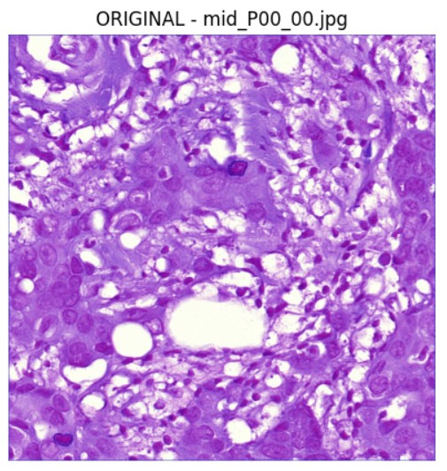
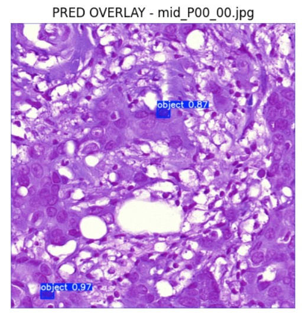
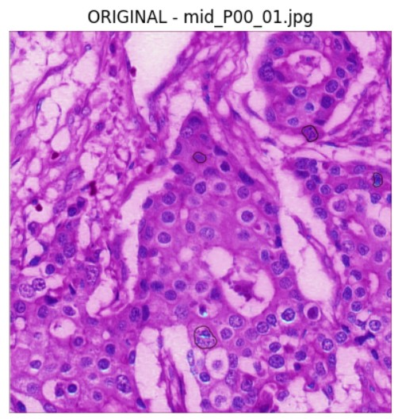
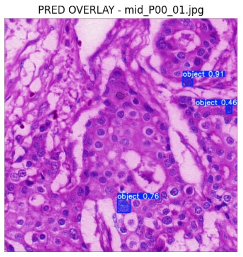

# ICPR14_MiDeSeC

# ICPR14 & MiDeSeC ile YOLOv8 Segmentasyon Eğitimi (Macenko Normalizasyonu + İki Aşamalı Fine-Tune)

Bu depo, **MiDeSeC** ve **ICPR14** veri setleri kullanılarak **YOLOv8n-seg** tabanlı segmentasyon modeli eğitimi için uçtan uca bir eğitim hattı (pipeline) sunar. Çalışma;  
(i) **Macenko renk normalizasyonu** ile görüntü renk dağılımlarının standardizasyonu,  
(ii) veri/etiket doğrulama (poligon overlay) modülü,  
(iii) **MiDeSeC + ICPR14 birleşik veri seti** üzerinde **iki aşamalı eğitim (stage-1 pretrain + stage-2 fine-tune)**,  
(iv) test değerlendirmesi ve görselleştirme adımlarını içerir.

> Not: Bu proje Colab/Drive dizin yapısı ile çalışacak şekilde hazırlanmıştır; yerelde çalıştırmak için yol (path) düzenlemeleri gerekebilir.

---

## İçerik
- [Amaç ve Kapsam](#amaç-ve-kapsam)
- [Yöntem](#yöntem)
- [Veri Setleri](#veri-setleri)
- [Proje Yapısı](#proje-yapısı)
- [Kurulum](#kurulum)
- [Çalıştırma](#çalıştırma)
- [Değerlendirme ve Çıktılar](#değerlendirme-ve-çıktılar)
- [Sonuçlar](#sonuçlar)
- [Alıntılama](#alıntılama)
- [Lisans ve Notlar](#lisans-ve-notlar)

---

## Amaç ve Kapsam
Bu çalışmanın amacı, farklı kaynaklardan gelen görsel verilerdeki **renk/ışık farklılıklarını azaltarak** segmentasyon performansını iyileştirmek ve birleşik veri ile daha genellenebilir bir model elde etmektir. Bunun için:
- **Macenko normalizasyonu** ile boyama/aydınlatma değişkenliği azaltılır,
- YOLO segmentasyon etiketleri **görsel olarak doğrulanır**,
- Birleştirilmiş veri üzerinde **aşamalı eğitim** uygulanır.

---

## Yöntem
### 1) Macenko Normalizasyonu (Renk Standardizasyonu)
Görüntüler, Macenko yaklaşımıyla normalize edilerek veri setleri arası renk dağılımı farkları minimize edilir. Bu adım özellikle farklı cihaz/ortam koşullarında elde edilen görüntülerde modelin genellemesini artırmayı hedefler.

### 2) Etiket Doğrulama (Ground-Truth Poligon Overlay)
Segmentasyon etiketleri (poligonlar), görüntü üzerine bindirilerek (overlay) görsel kontrol yapılır. Amaç; hatalı/bozuk etiketleri eğitim öncesi tespit etmektir.

### 3) Birleştirme ve İki Aşamalı Eğitim
- **Stage-1:** Birleşik veri üzerinde başlangıç eğitimi (augment açık, sınırlı mosaic vb.)
- **Stage-2:** Stage-1’den gelen en iyi ağırlıklar ile **fine-tune** (daha konservatif augment; mosaic kapalı vb.)

---

## Veri Setleri
Bu depo, aşağıdaki veri setlerini kullanacak şekilde kurgulanmıştır:
- **MiDeSeC**
- **ICPR14**

> Veri setlerine ait lisans/erişim koşulları ilgili kaynaklara aittir. Bu depo doğrudan veri paylaşmaz; kullanıcı kendi erişimiyle veriyi yerleştirir.

---

## Proje Yapısı
Colab/Drive üzerinde örnek dizinler:
- `/content/drive/MyDrive/Colab Notebooks/MiDeSeC`
- `/content/drive/MyDrive/Colab Notebooks/ICPR14`
- `/content/drive/MyDrive/Colab Notebooks/MERGED_YOLO`
  - `images/train`, `images/val`, `images/test`
  - `labels/train`, `labels/val`, `labels/test`
  - `merged_midesec_icpr.yaml`

Eğitim çıktı klasörleri (Ultralytics):
- `/content/runs/segment/merged_stage1`
- `/content/runs/segment/merged_stage2_ft`

---

## 📊 Deneysel Sonuçlar

Bu bölümde, MiDeSeC + ICPR14 birleşik veri seti üzerinde eğitilen **YOLOv8n-seg** modelinin **nicel (quantitative)** ve **nitel (qualitative)** sonuçları sunulmaktadır.

---

### 🔹 Test Seti – Nicel Sonuçlar

#### Nesne Tespiti (Bounding Box)

| Metric | Değer |
|------|------:|
| Precision (P) | **0.692** |
| Recall (R) | **0.818** |
| mAP@50 | **0.683** |
| mAP@50–95 | **0.609** |

---

#### Segmentasyon (Mask)

| Metric | Değer |
|------|------:|
| Precision (P) | **0.692** |
| Recall (R) | **0.818** |
| mAP@50 | **0.683** |
| mAP@50–95 | **0.535** |

---

#### En İyi F1 Skoru (Confidence Taraması)

| Ölçüt | Değer |
|------|------:|
| **Best F1 Score** | **0.7667** |
| **Optimal Confidence Threshold** | **0.33** |

Bu eşik değeri, precision–recall dengesi açısından en uygun nokta olarak belirlenmiştir.

---

#### Alternatif Test Değerlendirmesi (İlk Değerlendirme)

| Metric | Box | Mask |
|------|------:|------:|
| Precision | 0.651 | 0.651 |
| Recall | 0.905 | 0.905 |
| mAP@50 | 0.723 | 0.723 |
| mAP@50–95 | 0.635 | 0.531 |

---

### 🔹 Nitel Sonuçlar (Görsel Karşılaştırmalar)

Aşağıda, test setinden seçilen örnek görüntüler üzerinde **orijinal görüntüler** ile **model tahminlerinin (overlay)** karşılaştırmaları sunulmaktadır.  
Model, özellikle hücresel yapıların lokalizasyonunda yüksek güven skorları ile başarılı tespitler gerçekleştirmiştir.

#### Örnek–1
<p align="center">
  
  
</p>
<p align="center"><em>Sol: Orijinal görüntü — Sağ: Model tahmini (confidence ≈ 0.87–0.97)</em></p>

---

#### Örnek–2
<p align="center">
  
  
</p>
<p align="center"><em>Sol: Orijinal görüntü — Sağ: Model tahmini (confidence ≈ 0.76–0.91)</em></p>

---

### 📝 Akademik Değerlendirme

Model, test seti üzerinde **yüksek recall değerleri** ile özellikle hedef nesneleri kaçırmama konusunda güçlü bir performans sergilemiştir.  
Bounding box ve mask sonuçları karşılaştırıldığında, **segmentasyon mAP@50–95** değerinin daha düşük olması, piksel-seviyesinde sınır belirlemenin daha zor bir problem olduğunu göstermektedir.

Nitel sonuçlar incelendiğinde, modelin:
- Hücresel yapıları doğru bölgelerde lokalize ettiği,
- Yüksek confidence değerleri ürettiği,
- Düşük confidence’lı tahminlerin genellikle sınır belirsizliği olan bölgelerde oluştuğu  
gözlemlenmiştir.

Bu bulgular, önerilen yaklaşımın histopatolojik görüntüler üzerinde **güvenilir ve genellenebilir** bir segmentasyon performansı sunduğunu göstermektedir.

---

## Kurulum
### Ortam
- Python >= 3.8 (öneri: 3.10+)
- (Opsiyonel) GPU: CUDA destekli ortam

### Bağımlılıklar
Çalışmada kullanılan temel kütüphaneler:
- `ultralytics`
- `torch`
- `opencv-python (cv2)`
- `numpy`, `pandas`
- `matplotlib`
- `torchstain` (Macenko normalizasyonu)
- `tqdm`
- `Pillow`

Örnek kurulum:
```bash
pip install -U ultralytics torch torchvision torchaudio opencv-python numpy pandas matplotlib tqdm pillow torchstain
